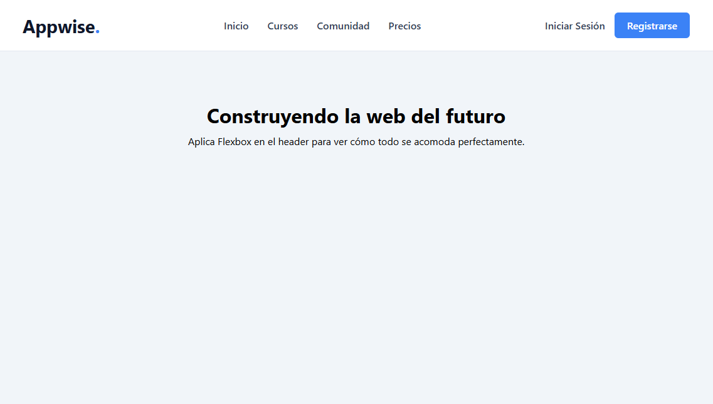

# 🎯 Reto 04: La Barra de Navegación (Flexbox)

¡Bienvenido al reto donde Flexbox te salvará la vida!

El 99% de las páginas web tienen una barra de navegación (Navbar) en la parte superior. Históricamente, poner el logo a la izquierda y los enlaces a la derecha era una pesadilla. Hoy, con tres líneas de Flexbox, lo resuelves en segundos.

## 🎯 El Objetivo

Utilizar las propiedades de un contenedor Flex (`display`, `justify-content` y `align-items`) para distribuir correctamente los elementos de un Navbar.

### 👀 Referencia Visual (Resultado Esperado)

_(Profe: Reemplaza esta línea con tu captura del navbar terminado)_

---

## 📝 Instrucciones

Abre el archivo `index.html` y mira el archivo `style.css`. Tu trabajo es completar las propiedades CSS faltantes hasta que el navbar se vea como en la imagen de arriba.

**Lo que debes lograr visualmente:**

**1. El Contenedor Principal (`.navbar`):**

- El Logo, los enlaces y los botones deben estar en una sola fila horizontal (no apilados uno debajo del otro).
- El Logo debe quedar pegado a la izquierda, los enlaces en el centro y los botones a la derecha, como si se empujaran a los extremos.
- Todo debe estar perfectamente alineado en el centro vertical de la barra.

**2. La Lista de Enlaces (`.nav-links`):**

- Los enlaces deben aparecer en fila, uno al lado del otro, con un espacio cómodo entre ellos.
- No deben tener los puntitos de lista por defecto.

**3. El Grupo de Botones (`.nav-botones`):**

- Los dos botones (Login y Registro) deben estar en fila con un pequeño espacio entre ellos.
