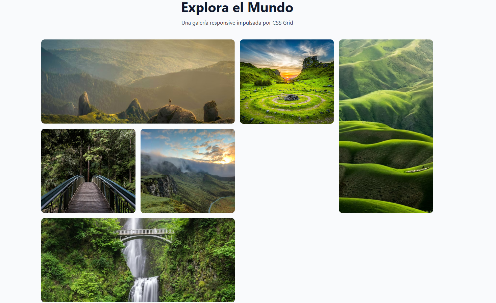

# 📸 Reto 06: Galería Asimétrica (CSS Grid)

¡Llegó la hora de la verdad! Vas a utilizar el "Santo Grial" del diseño Responsive que aprendiste en la lección anterior para crear una galería de imágenes moderna.

## 🎯 El Objetivo

Construir una cuadrícula de imágenes que se adapte automáticamente al tamaño de la pantalla, haciendo que algunas fotos se destaquen ocupando más espacio que otras.

### 👀 Referencia Visual (Resultado Esperado)

---

## 📝 Instrucciones

Abre el archivo `index.html`. Verás un contenedor con varias imágenes de paisajes. Tu misión es ir al archivo `style.css` y darles estilo hasta que la galería se vea como en la imagen de arriba.

**Lo que debes lograr visualmente:**

**1. El Contenedor de la Galería (`.galeria`):**

- Las fotos deben organizarse en una cuadrícula de varias columnas con un espacio uniforme entre ellas.
- La cuadrícula debe ser **responsive**: en una pantalla ancha se ven muchas columnas, y al achicar la ventana, las columnas se reducen solas sin que tengas que escribir Media Queries.
- Todas las celdas de la galería deben tener la misma altura fija para que la cuadrícula sea ordenada.

**2. Las Imágenes (`.item img`):**

- Cada imagen debe rellenar completamente su celda, sin dejar espacios en blanco ni deformarse (no se deben estirar ni aplastar).
- Deben tener las esquinas ligeramente redondeadas.

**3. Fotos Destacadas (Rompiendo la Grilla):**

- Algunas fotos son más importantes que otras. Identifica en el HTML cuáles tienen clase especial:
  - Las fotos **horizontales destacadas** deben ocupar el doble de ancho que una foto normal.
  - Las fotos **verticales destacadas** deben ocupar el doble de alto que una foto normal.
