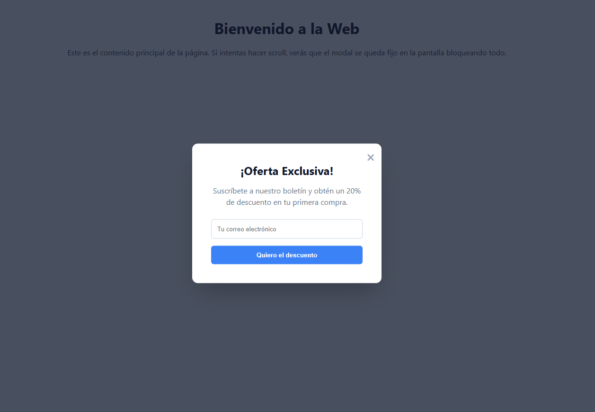

# 🪟 Reto 08: El Modal Perfecto (Positioning)

¡Llegó el momento de sacar elementos del flujo normal!

Seguro has visto esas ventanas emergentes que aparecen sobre el contenido, oscureciendo el fondo y obligándote a interactuar con ellas. Se llaman **Modales**. Hoy vas a construir uno desde cero utilizando las propiedades de posicionamiento.

## 🎯 El Objetivo

Crear una capa superpuesta (`overlay`) que cubra el 100% de la pantalla usando `position: fixed`, y centrar una caja blanca en su interior.

### 👀 Referencia Visual (Resultado Esperado)

---

## 📝 Instrucciones

Abre el archivo `index.html`. Verás que hay una página web de fondo (para simular contenido) y, al final del código, un bloque llamado `.modal-overlay`.

Ve a tu archivo `style.css` y completa las propiedades faltantes hasta que el modal se vea como en la imagen de arriba.

**Lo que debes lograr visualmente:**

**1. La Capa Oscura (`.modal-overlay`):**

- Debe cubrir el **100% de la pantalla** (ancho y alto), incluso si haces scroll hacia abajo. El contenido de fondo debe quedar oscurecido y bloqueado.
- Debe aparecer **por encima de todo** el contenido de la página.

**2. La Caja del Modal (`.modal-box`):**

- La cajita blanca debe estar perfectamente centrada en la pantalla, tanto horizontal como verticalmente.
- Pista: posicionar algo al `50%` desde arriba y desde la izquierda no lo centra exactamente desde su propio centro. Hay una propiedad CSS que te permite corregir ese desplazamiento.

**3. El Botón de Cierre (`.btn-cerrar`):**

- El botón con la 'X' debe estar pegado a la **esquina superior derecha** de la caja blanca, no de la pantalla completa.
- Pista: para que `position: absolute` de un hijo se posicione relativo a su padre y no a toda la página, el padre necesita tener una propiedad especial. Recuerda la teoría.
