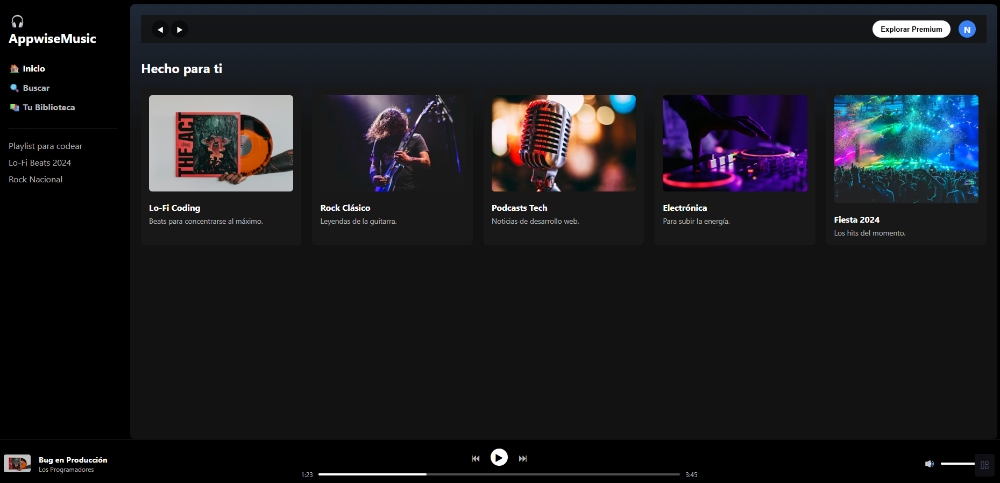

# 🏆 09: El Proyecto Final y el Desafío de Graduación

¡Felicidades! Si llegaste hasta aquí y tu cabeza aún no ha explotado con Flexbox y Grid, ya tienes el nivel necesario para llamarte **Maquetador Web**.

Has aprendido a usar el Modelo de Caja, a alinear elementos en una dimensión (Flexbox), a construir arquitecturas de dos dimensiones (Grid) y a sacar elementos del flujo normal (Posicionamiento).

Ahora es momento de unir todas las piezas del rompecabezas.

---

## 🚀 FASE 1: El Super Proyecto Final (En Clase)

Durante nuestra última clase de CSS, construiremos juntos un proyecto real de principio a fin. Crearemos una interfaz moderna (nuestro propio clon de plataforma musical: **AppwiseMusic**) donde usaremos absolutamente todo lo que aprendimos.

### 👀 Referencia Visual (Lo que vamos a construir)

> **💡 Nota del Profe:** Tu proyecto no tiene que quedar _exactamente_ igual pixel por pixel. Lo verdaderamente importante es que apliques los conceptos: **Flexbox** para la barra lateral y el navbar, **CSS Grid** para que los álbumes sean responsive, y **Position Fixed** para que el reproductor de abajo te persiga. ¡Siéntete libre de cambiar los colores, las fotos o los textos para hacerlo 100% tuyo!

**¿Qué debes hacer en clase?**

1. Sigue al profesor en vivo.
2. Escribe el código en tu archivo `index.html` y `style.css` dentro de esta carpeta.
3. Pregunta si te pierdes. En un proyecto grande, la estructura de las cajas (padres e hijos) es vital.

---

## ☠️ FASE 2: El Desafío de Graduación (Tu Tarea Real)

¿Recuerdas ese repositorio de **HTML5** que hiciste en el módulo anterior con 10 proyectos aburridos en blanco y negro? ¡Llegó la hora de darles vida!

Tu verdadera prueba de fuego para aprobar el módulo de CSS no es hacer un examen teórico, es **estilizar tus propios proyectos**.

### 📜 Tu Misión:

Ve a tu repositorio personal de HTML y aplícale CSS a, por lo menos, **3 de los proyectos** que construiste.

Te recomendamos este orden de dificultad:

- **Nivel Fácil:** `01-Receta-Abuela` (Aplica fuentes atractivas, colores de fondo, márgenes para centrar la receta y dale estilo a las listas).
- **Nivel Intermedio:** `04-Landing-Producto` o `08-Carrito-Compras` (Usa Flexbox para alinear los productos y el Navbar. Aplica un Modal con `position: fixed` para el botón de comprar).
- **El Jefe Final:** `10-Dashboard-Admin` (Usa CSS Grid para armar el layout de la barra lateral, el encabezado y el contenido principal. Hazlo responsive con `minmax()`).

### 💡 Reglas de Oro para la Tarea:

1. **Crea un archivo `style.css`** en cada carpeta de proyecto HTML que vayas a estilizar y vincúlalo en el `<head>`.
2. **Usa variables CSS:** Declara tus colores principales en `:root` para mantener consistencia.
3. **Reset básico siempre:** No olvides tu `* { margin: 0; padding: 0; box-sizing: border-box; }` al inicio.
4. **Mobile First:** Intenta que se vea bien en celular primero, y luego usa la magia de Flex/Grid para que se adapte a escritorio.

---

> _"Un buen desarrollador no es el que memoriza todas las propiedades de CSS, es el que sabe cómo combinarlas para resolver un problema de diseño."_

¡Mucho éxito, futuros Full Stack! Nos vemos en el módulo de JavaScript para darle interactividad a todo esto. 🚀
